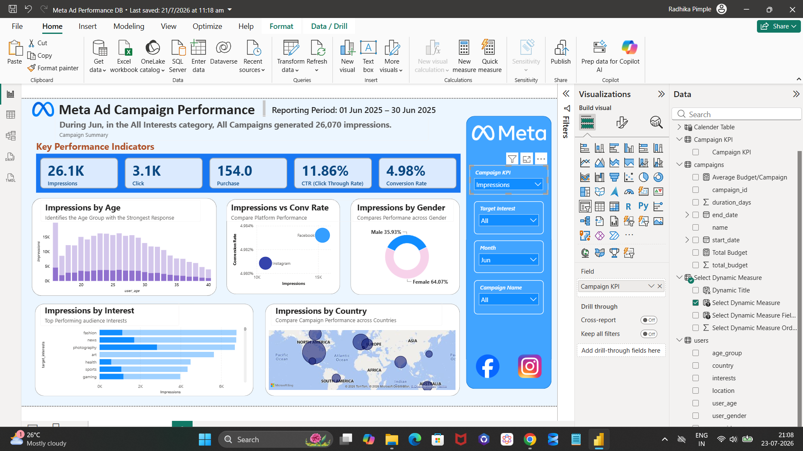
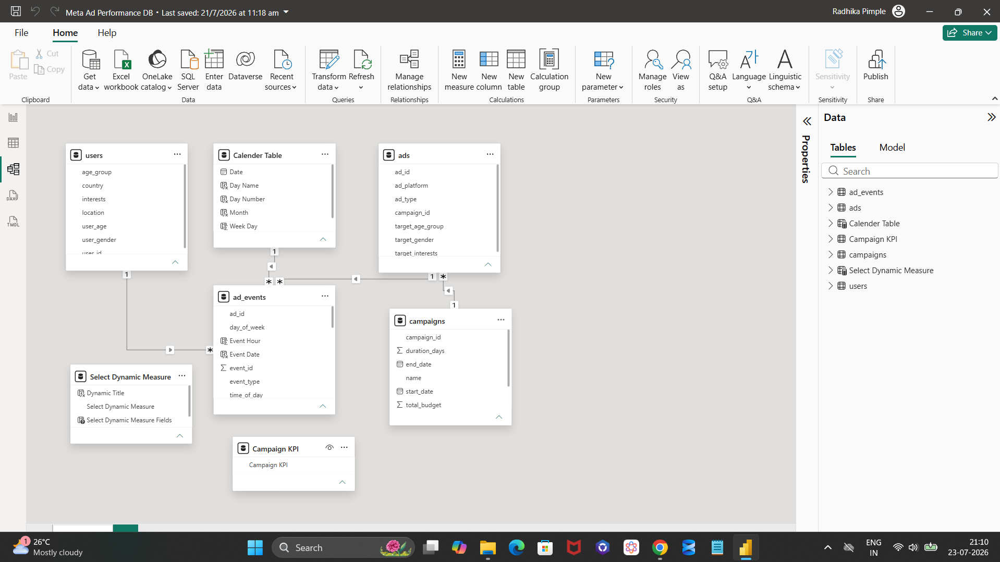
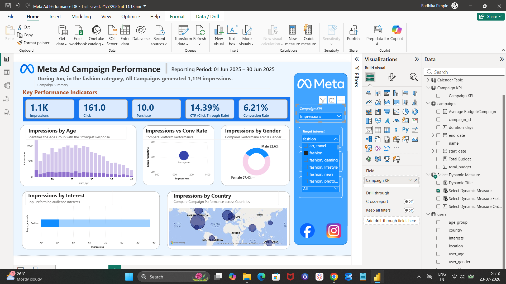

# Meta Ad Campaign Performance Dashboard

## About this project

Marketing teams often struggle to identify which campaigns generate the highest engagement, conversions, and return on advertising spend across multiple audience segments and platforms.

So I built this Power BI dashboard to analyze 3 months of paid ad performance across Facebook and Instagram. I wanted to work with a dataset that actually makes me think like an analyst instead of just charting one flat file, so I picked a Kaggle dataset, built the relationships, write the DAX measures, and figure out what story the numbers were telling.



## The problem I set out to answer

I framed this as if I were a data analyst supporting a marketing team that runs paid campaigns on Meta platforms (Facebook and Instagram). Over 3 months, the team launched 50 campaigns across 200 ads, targeting different age groups, genders, and interest categories like fashion, tech, travel, finance, and health. Every ad tracked the full funnel from impression to purchase.

The question I wanted my dashboard to answer: which platform performs better, which age group and interest actually convert instead of just clicking, and where should ad spend go next quarter. That's the business problem behind every visual in this report.

## About the data

I used the [Social Media Advertisement Performance dataset](https://www.kaggle.com/datasets/alperenmyung/social-media-advertisement-performance) from Kaggle. It's a synthetic dataset (generated using Python's Faker and NumPy) built to mimic the kind of relational data model I'd actually get handed at a real job, split across 4 connected tables:

| Table | What it holds | Rows |
|---|---|---|
| `campaigns.csv` | Campaign name, start/end date, duration, total budget | 50 |
| `ads.csv` | Individual ad creatives, platform (Facebook/Instagram), ad type, and targeting (age, gender, interest) | 200 |
| `users.csv` | The audience: age, gender, country, location, interests | 9,841 |
| `ad_events.csv` | Every single interaction logged (impression, click, like, comment, share, purchase) with timestamp | 400,000 |

Reporting period I analyzed: **07 May 2025 to 06 Aug 2025**.

I picked this dataset over the more common flat "one row per ad" files on Kaggle on purpose. With 4 separate tables, I had to actually model the relationships in Power BI instead of dropping one CSV into a chart. That's closer to what I'd get handed in an actual analyst role.

## Tools I used

- **Power BI Desktop** for data modeling, DAX measures, and the report itself
- **Power Query** for cleaning and shaping the raw CSVs before loading them in

## Data model

I connected the 4 tables in a star-schema-style layout: `ads` and `users` both link into `ad_events` (the fact table logging every interaction), and `campaigns` links into `ads`. I also built a separate Calendar table to drive all the date-based filtering (month, day of week, week number).



## Dashboard walkthrough

I built one main report page with a metric selector, so the same set of visuals can switch between showing Impressions, Clicks, Purchases, CTR, or Conversion Rate depending on what I'm checking.

**KPI cards** — Impressions, Clicks, Purchases, CTR, and Conversion Rate for whatever filters are applied, at the top.

**Click by Age** — a histogram across `user_age`, to spot which age band responds strongest.

**Click vs Conversion Rate** — a scatter plot comparing Facebook against Instagram, so I can see at a glance if one platform wins on clicks but loses on actual conversions.

**Click by Gender** — a donut chart of engagement split by gender.

**Click by Interest** — a horizontal bar chart ranking which target interest category (fashion, tech, travel, etc.) drives the most engagement.

**Click by Country** — a map showing where the engaged audience is concentrated.

I added filters on the right for Campaign, Target Interest, Month, and Campaign Name, so I can drill from "all campaigns, all interests" down to "just the fashion campaigns in May."



## Key findings

These are pulled from the full 3-month dataset (07 May – 06 Aug 2025), straight from the dashboard and cross-checked against the raw CSVs:

- **339,812 impressions** produced **40,145 clicks** (CTR: **11.79%**) and **2,031 purchases** (conversion rate: **5.07%**) across all campaigns.
- **Platform split:** Instagram had a slightly higher CTR (11.86% vs Facebook's 11.76%), but Facebook converted better on those clicks (5.21% vs Instagram's 4.82%). Instagram grabs attention better, Facebook closes better.
- **Ad format:** Video had the highest CTR of any format (11.90%) but only average conversion (5.07%). Stories had a slightly lower CTR (11.73%) but the best conversion rate of all 4 formats (5.34%). Image ads had a decent CTR (11.88%) but the weakest conversion rate (4.67%), meaning they got clicked a lot but didn't close as well.
- **Age:** the 25–34 age group drove the largest share of clicks (39.4%), followed by 18–24 (29.6%). Together, users under 35 account for roughly 7 out of every 10 clicks.
- **Geography:** the US alone accounts for 28.8% of all clicks, followed by the UK (14.2%), Canada (9.5%), and India (9.1%). Ad spend concentrated in these 4 countries would be reaching where the engagement already is.
- **A targeting mismatch I found while digging deeper:** the dashboard's gender breakdown (shown as Male 36.4% / Female 63.6%) is based on which gender each ad was *targeted at*, not the gender of the users who actually clicked. When I checked the actual users behind those clicks, the real split was closer to Male 52%, Female 33%, Other 10%. In plain terms, campaigns were pointed more at female audiences, but a big share of the people actually engaging were male. I only caught this because I cross-checked the surface-level chart against the raw user data instead of taking it at face value, and I think that's the most important finding in this whole project.

## Limitations

- The dataset is synthetic, generated with Faker and NumPy, so the patterns are randomized rather than pulled from a real ad account. I'm treating these findings as a demonstration of my analysis process, not real market research.
- The demographic fields describe the people in the `users` table, not necessarily the exact person behind every single event. The targeting mismatch finding above came from comparing ad-level targeting fields against user-level actuals, which I think is exactly the kind of check I should be running before trusting any dashboard at face value.

## Files in this repo

```
meta-ad-campaign-performance-dashboard/
├── README.md
├── Meta_Ad_Performance_DB.pbix        <- open this in Power BI Desktop
├── data/
│   ├── campaigns.csv
│   ├── ads.csv
│   ├── users.csv
│   └── ad_events_sample.csv            <- first 1,000 rows only (full file is 400K rows / 25MB, linked below instead)
└── screenshots/
```

I did not include the full `ad_events.csv` (400,000 rows) to keep the repo lightweight. It's available directly from the [Kaggle dataset page](https://www.kaggle.com/datasets/alperenmyung/social-media-advertisement-performance).

## How to open this project

1. Download or clone this repo.
2. Install [Power BI Desktop](https://www.microsoft.com/en-us/power-platform/products/power-bi/downloads) (free, Windows only).
3. Open `Meta_Ad_Performance_DB.pbix`.
4. If Power BI asks to refresh or locate the data source, point it to the `data/` folder in this repo (or the full CSVs downloaded from Kaggle).

---

*I built this as part of my data analyst portfolio. Feedback is welcome.*
